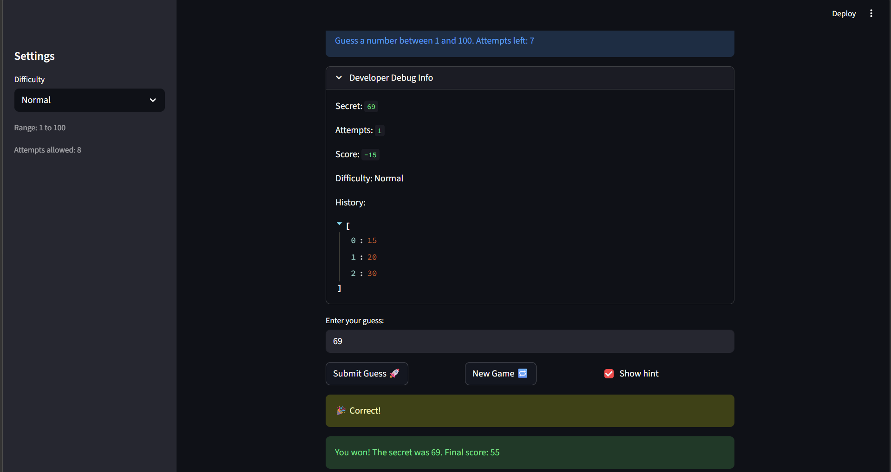

# 🎮 Game Glitch Investigator: The Impossible Guesser

## 🚨 The Situation

You asked an AI to build a simple "Number Guessing Game" using Streamlit.
It wrote the code, ran away, and now the game is unplayable.

- You can't win.
- The hints lie to you.
- The secret number seems to have commitment issues.

## 🛠️ Setup

1. Install dependencies: `pip install -r requirements.txt`
2. Run the broken app: `python -m streamlit run app.py`

## 🕵️‍♂️ Your Mission

1. **Play the game.** Open the "Developer Debug Info" tab in the app to see the secret number. Try to win.
2. **Find the State Bug.** Why does the secret number change every time you click "Submit"? Ask ChatGPT: _"How do I keep a variable from resetting in Streamlit when I click a button?"_
3. **Fix the Logic.** The hints ("Higher/Lower") are wrong. Fix them.
4. **Refactor & Test.** - Move the logic into `logic_utils.py`.
   - Run `pytest` in your terminal.
   - Keep fixing until all tests pass!

## 📝 Document Your Experience

- [x] Describe the game's purpose.
      A simple number-guessing game where the player tries to guess a secret number between 1 and 100. The game gives hints like “Too High” or “Too Low” and tracks attempts and score.
- [x] Detail which bugs you found.
      The secret number was sometimes treated as a string, causing comparisons to behave lexicographically and the hints to always say “Go LOWER”. The app also reset state unexpectedly on button clicks.
- [x] Explain what fixes you applied.
      I moved core logic into `logic_utils.py` for testability, fixed the hint logic so it compares numbers correctly, and made the secret number stable in Streamlit session state.

## 📸 Demo

- ✅ The game now correctly shows “Too High”/“Too Low” hints and allows winning.

## 🚀 Stretch Features

- [ ] [If you choose to complete Challenge 4, insert a screenshot of your Enhanced Game UI here]
